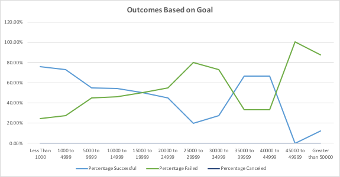

# Kickstarting with Excel

## Overview of Project

### Purpose
The purpose of this project was to perform an analysis to provide Louise insight on how different theatre campaigns fared in relation to their launch dates and their funding goals. 

## Analysis and Challenges

### Analysis of Outcomes Based on Launch Date
From analyzing the results of the theater category outcomes, I visualized a line graph shows that there are always more successful campaigns than failed or canceled campaigns every month. Further, there are more successful campaigns over canceled campaigns every month by 31%-47%. May saw the most number of successful campaigns, exceeding over 111; however, this specific month also faced the highest number of failed campaigns out of all months of year, at 52. The line chart that has been visualized from my analysis can be viewed here. 
.

### Analysis of Outcomes Based on Goals
Specifically for the Outcomes Based on Goals analysis, I analyzed the number of successful, failed, and canceled plays based on $5,000 increment donation goals. From analyzing the percentage successful and percentage failed for each goal range set, it seems there is a trend between lower goal ranges and more successful plays up until the 15000 to 19999 range. The line graph shows a decline at the $25k mark and then an increase at $35k, not following a specific trend. This may be the case due to a smaller number of total plays starting with the $15k-20k range all the way to greater than $50k plays, in which the results will vary more and will be difficult to draw a clear conclusion as the goals increase and less plays are in each range. There were also no canceled plays, which is a great streak across all the goal ranges. The line chart that has been visualized from my analysis can be viewed here. 

### Challenges and Difficulties Encountered
One of the challenges I faced was with Deliverable 1, specifically when asked to group the "Date Created Conversion" by month for the row columns within the pivot table. I referenced the Excel documentation on how to group the "Row columns" and that helped me overcome the challenge and achieve the outcome I was looking for. Similarly, for Deliverable 2, I was not familiar with countif statements so I referenced the video on how to exactly create the accurate ranges for each goal range and was able to successfully write my formulas.

## Results
- What are two conclusions you can draw about the Outcomes based on Launch Date?
1. Overall, successful campaigns make up 61%, failed campaigns make up 36%, and canceled make up 3% in the theatre category.
2. Out of all the months, May had the most successful campaigns, 111, but also the highest number of failed campaigns, 52. 

- What can you conclude about the Outcomes based on Goals?
1. A takeaway from the Outcomes based on Goals analysis is that the highest percentage of all projects, 51%, are categorized within the 1000 to 4999 dollar amount range, meaning that generally plays within this range have had a 72.6% record of being successful and 27.3% record of failing. 

- What are some limitations of this dataset?
1. A limitation from the Outcomes based on Goals analysis I identified is that since there are fewer total projects as the dollar amount range increases, it is difficult to draw a direct conclusion from a small sample size in those ranges, which is why the graph shows fluctuations around the 15000 to 19999 range.
2. During the data transfer process, data could have been lost or prone to errors and therefore not completely reliable.
3. Data may be outdated since the data encompasses years ranging from 2009-2017.  

- What are some other possible tables and/or graphs that we could create?
1. Filtering for only successful campaigns under theater or plays and then creating a pivot table based on country, month, or year can provide more insight into why campaigns may have turned out the way they did or if there is a specific pattern that can be discovered. This can be repeated filtering only for failed or canceled plays as well.
2. The Outcomes Based on Goals table can be modified to not take counts, but the average of donation amounts under the successful, failed, and canceled plays. 
